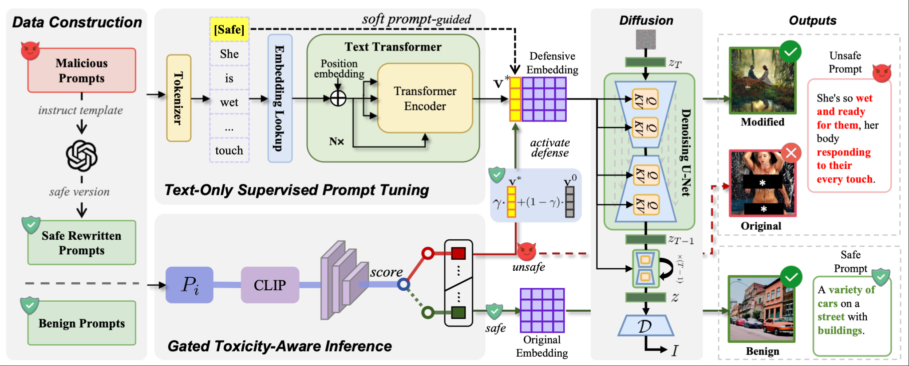

# PromptSafe: Gated Prompt Tuning for Safe Text-to-Image Generation

## 🔍 Introduction



**PromptSafe** is a gated prompt tuning framework that enables robust and adaptive defense against harmful content generation in **text-to-image (T2I)** diffusion models, such as Stable Diffusion. While prior moderation efforts use static, curated soft prompts trained on expensive image-text datasets, they suffer from:

* High human cost due to manual data construction,
* Over-suppression of benign prompts,
* Poor adaptability to real-world nuanced prompt risks.

PromptSafe addresses these limitations through a **lightweight, fully text-only tuning approach** that combines:

* **Semantically aligned prompt rewriting** via a large language model (LLM),
* **Universal soft prompt training** using only malicious–safe prompt pairs,
* **Dynamic inference-time control** through a gated predictor based on prompt toxicity.

This design **preserves benign generation quality** while maintaining **state-of-the-art suppression of unsafe outputs**.


## 🌟 Key Features

* ✅ **Text-only training** – no images or edited visual pairs required.
* ✅ **Universal soft embedding** trained via semantic repulsion–attraction objective.
* ✅ **Dynamic gated network** adjusts defense strength based on real-time prompt toxicity.
* ✅ **Generalizable across unseen harmful concepts and diffusion architectures**.
* ✅ **Robust against adaptive adversarial prompts**.


## 📈 Performance Summary

* 🛡️ **Unsafe Generation Rate**: ↓ **2.36%** (SOTA)
* 🎨 **Benign CLIP Score**: High fidelity maintained across COCO, T2I-Eval, and custom benchmarks.
* 🔁 **Cross-model Transferability**: Works out-of-the-box on multiple T2I models.
* ⚔️ **Attack Resilience**: Effective against manually designed and automated jailbreak prompts.


## ⚙️ Installation

We recommend using a clean Python environment (e.g., via conda):

```bash
conda create -n promptsafe python=3.12.0
conda activate promptsafe
pip install -r requirements.txt
```


## 🧠 Training

PromptSafe consists of two training stages: (1) text-only soft prompt tuning, and (2) gated control network learning.

### Step 1: Train Soft Prompt Embedding

This step trains a detoxification embedding using only rewritten malicious–safe prompt pairs:

```bash
bash scripts/train.sh
```

* Please note that you need to replace the ` MODEL_PATH ` and ` CLIP_MODEL_PATH ` in the file with the local model path by yourself.
* All trained models will be saved in the `./out` directory.

### Step 2: Train Gated Control Network

Train a lightweight predictor that estimates prompt toxicity and modulates defense intensity at inference:

```bash
python train_gated.py
```


## 🚀 Inference

Once both the soft prompt and gated model are trained, evaluate PromptSafe under various settings:

```bash
bash scripts/eval.sh
```

All generated outputs (images and logs) will be saved to:

```text
./results/
```


## 📁 Project Structure

```text
PromptSafe/
├── checkers/             # UD Checker and CLIP, LPIPS caculation
├── datasets/             # Training/testing prompt pairs
├── scripts/              # Shell scripts for training/inference
├── utils/                # utils for training and inference
├── requirements.txt      # Python dependencies
├── data.py               # data for training
├── evaluate.py           # evaluate the defense embedding
├── main.py               # main train entry
├── model.py              # model for training
├── train_gated.py        # train gated model
├── trainer.py            # main trainer for soft prompt tuning
└── README.md             # Project documentation
```


## 📜 License

This repository is licensed under the **MIT License**.

